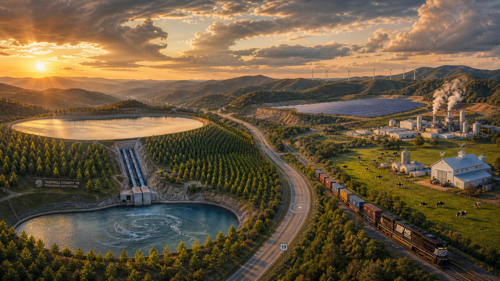

# Tazewell
# From Cattle Drives to Clean Power: A Strategic Economic Growth Plan for the US 19 Corridor

## Detailed Book Outline

---

### Part I: The Historical Foundation (1800-1950)

# Chapter One: The Agricultural Roots of Tazewell County (1800–1880)

## Introduction: The Foundation of a Region

Before the whistle of the locomotive echoed through the mountain passes and before the boomtowns of the coal era sprang from the wilderness, Tazewell County was defined by its soil. The land itself—ancient, weathered, and remarkably fertile—dictated the rhythms of daily life for the first generations of settlers who carved homesteads from the dense Appalachian forests. This agricultural foundation, established in the decades following the county's formation in 1799, would prove remarkably resilient, persisting even as the industrial age transformed the region in ways its founders could scarcely have imagined.

The story of Tazewell County's agricultural economy is not merely a chronicle of crops and livestock, but a window into a vanished world of self-sufficiency, barter, and deep connection to the natural environment. In the years between 1800 and 1880, the county's residents developed a complex web of economic relationships rooted in the land, creating a society that was simultaneously isolated from and connected to the broader currents of American commerce. Understanding this foundational era is essential for comprehending how the region would later respond to the transformative forces of industrialization, and how the agricultural heritage continues to shape its identity today.

As one contemporary observer noted, the county possessed a landscape of dramatic contrasts—mountain ranges of "immense height" giving way to "beautiful valleys, of a black, deep soil, very fertile," creating an environment uniquely suited to both subsistence farming and commercial agriculture . This fundamental geographic reality would govern the region's development for generations, establishing patterns of settlement, trade, and economic aspiration that would prove remarkably durable even as the world around it changed.

## The Land and Its Formation

Tazewell County came into official existence on December 20, 1799, when the Virginia General Assembly formally carved its boundaries from portions of Russell and Wythe counties . The new county stretched approximately sixty miles in length with a mean width of twenty-five miles, encompassing roughly 1,305 square miles of rugged Appalachian terrain . Named in honor of Henry Tazewell, a United States Senator from Virginia who served from 1794 until his death in 1799, the county represented the Commonwealth's continued expansion westward into the mountainous frontier .

The county's boundaries would shift over subsequent decades as additional territories were appended and later removed. Parts of Russell County were added in 1807 and 1835, portions of Washington and Wythe Counties were incorporated in 1826, and a section of Logan County in what would become West Virginia was added in 1834 . These adjustments reflected the fluid nature of frontier governance, where precise boundaries often followed the practical realities of settlement patterns and watershed geography rather than any predetermined plan.

Geologically, Tazewell County occupies a position of remarkable diversity and abundance. The region is traversed by several major mountain ranges—including Clinch Mountain, Rich Mountain, East River Mountain, and Paint Lick Mountain—which run in a generally southwesterly direction, creating a series of long, narrow valleys between their ridges . The county sits at a significant elevation, with the mean height of its arable soil estimated at approximately 2,200 feet above sea level . This elevation, combined with the mountain geography, creates a distinctive climate characterized by abundant rainfall and relatively cool temperatures, conditions ideally suited to certain types of agriculture.

The hydrological network of Tazewell County is equally notable. The Clinch River rises near Jeffersonville—the original name for the county seat of Tazewell—and drains nearly the entirety of the county . Important tributaries include the Maiden Spring Fork in Tazewell County itself and Copper Creek, which rises in neighboring Russell County . The Tug Fork of the Big Sandy River forms part of the county's northern border, while the Great Kanawha River receives numerous branches from the eastern section of the county . This abundance of water, combined with the limestone geology of the region, created a landscape of extraordinary agricultural potential.

## The Fertile Valleys and Their Soils

The most remarkable agricultural asset of Tazewell County lies in its valley soils, described by contemporaries as being of "a black, deep soil, very fertile" . These valleys, nestled between the mountain ranges that traverse the county, represent a geological gift of extraordinary value. The soils developed over millennia from the weathering of limestone bedrock, creating a rich, deep, and remarkably productive agricultural base that supported a diverse range of crops and livestock.

Among these agricultural valleys, Abb's Valley stands as the most celebrated. This "delightful tract" stretches approximately ten miles in length and about forty rods in width, bounded on both sides by lofty mountains . The valley derives its name from Absalom Looney, a hunter who is believed to have been the first white person to venture into its confines . What makes Abb's Valley particularly remarkable is its lack of a flowing stream, a geological anomaly that distinguishes it from most other Appalachian valleys . Despite this hydrological curiosity—or perhaps because of it—the valley possesses a soil of "extraordinary fertility," capable of supporting intensive agricultural production without the flooding and erosion problems that often accompany streamside farming .

The limestone geology that underpins the county's agricultural wealth has other important implications for farming communities. Inexhaustible quarries of limestone exist throughout the region, providing a ready source of lime for soil amendment . Farmers who understood the value of this resource could lime their fields to correct soil acidity and improve fertility, an agricultural practice that was relatively advanced for the period. The underlying limestone also influences the quality of the county's water, though springs in limestone areas are described as "uncertain, as the waters frequently disappear into the rock" .

The elevation and mountain geography of Tazewell County created distinct agricultural zones within relatively short distances. The lower valley bottoms, with their rich alluvial soils, supported the intensive cultivation of crops, while the mountain slopes provided excellent grazing for livestock. Contemporary observers noted that the limestone soils yielded grass "equal to that of Kentucky," establishing a direct link to the reputation of the famous Bluegrass region for superior livestock production . This recognition of the quality of Tazewell County's forage would prove crucial to the development of its beef cattle industry.

## The Principal Agricultural Staples

The agricultural economy of Tazewell County before 1880 was characterized by remarkable diversity. Contemporary accounts list the "principal staples" as "cattle, horses, hogs, feathers, tow and flax linen, beeswax, ginseng, seneca snakeroot, &c." . This list reveals an economy that balanced subsistence production with commercial opportunities, combining traditional agricultural products with specialized forest-derived commodities.

Cattle, listed first among the county's staples, were undoubtedly the most significant agricultural commodity . The mountain valleys provided excellent grazing, and farmers developed a reputation for producing beef cattle thought to be equal to those from "any other region of our country" . This recognition speaks to the quality of the county's forage and the skill of its livestock managers. Cattle served multiple purposes in the agricultural economy: they provided meat and dairy products for household consumption, could be driven to distant markets for cash, and served as a store of value that could be converted to currency when needed.

Horses represented another vital component of the agricultural economy, serving both as work animals and as a commodity for trade . In an era before mechanized transportation, horses were essential for plowing fields, hauling produce, and providing personal transportation. The quality of horses bred in the county would have been a matter of considerable importance to farmers who depended on their strength and endurance for daily labor and for transporting goods to distant markets.

Hogs were the third major livestock category, providing meat that could be preserved through salting or smoking for winter consumption . Unlike cattle, which required extensive grazing land, hogs could be raised in forested areas where they rooted for acorns and other mast. This made them an ideal livestock choice for farmers with limited cleared land, as the hogs could be turned loose in the woods to forage for themselves, requiring minimal labor and feed inputs.

## Forest Products and Gathering

The forests of Tazewell County provided a rich source of non-agricultural commodities that supplemented farm incomes and connected the region to broader commercial networks. Among these forest products, ginseng occupied a particularly important position . This medicinal root, highly valued in both American and Chinese markets, could be gathered from the county's extensive woodlands during specific seasons. The careful harvesting and preparation of ginseng required knowledge of the plant's preferred habitats and appropriate drying techniques, specialized skills that were typically passed down through families.

Seneca snakeroot, another medicinal plant found in the county's forests, was similarly harvested for commercial purposes . The root of this plant, native to North American woodlands, was valued for its medicinal properties and could be sold to merchants who traded in botanical remedies. The gathering of these forest medicinals represented an important source of cash income for farm families who might otherwise have limited access to currency.

Beeswax, listed among the county's principal staples, reveals the importance of apiculture to the agricultural economy . Honey provided a sweetener that was widely used in cooking and food preservation, while the wax itself had numerous applications in candle making, which was essential for household lighting. The production of beeswax and honey required careful management of hives and knowledge of the bees' seasonal cycles, skills that complemented the broader agricultural activities of farm families.

Feathers, particularly goose feathers, represented another valuable forest and farm product . In an era before synthetic insulation and bedding materials, feathers were essential for pillows, mattresses, and warm clothing. The careful plucking and preservation of feathers was a labor-intensive process, but one that provided important value from poultry raised on farms. The mention of feathers among the county's "principal staples" suggests that this was not merely a household necessity but a genuine commercial commodity.

## Tow and Flax Linen Production

The production of tow and flax linen represented one of the most labor-intensive aspects of Tazewell County's agricultural economy . Flax, a fiber crop that requires extensive processing to produce usable linen, was grown on many farms in the region. The cultivation of flax was itself demanding, requiring specific soil conditions and careful harvesting to ensure the quality of the fiber. But the true labor came after the harvest, when the flax stalks had to be retted (soaked in water to separate the fibers), dried, broken, scutched (beaten to remove remaining woody material), and finally spun into thread.

The mention of "tow" alongside "flax linen" reflects the distinction between different grades of linen fiber. The finest quality fibers were used for the production of fine linen cloth, which might be used for clothing, table linens, or other household purposes. The coarser tow fibers, which were shorter and rougher, were used for rope, twine, and coarse cloth. Both types of linen were valued commodities in the regional economy, representing a combination of household industry and commercial production.

The production of linen was typically a household enterprise, with women playing the primary role in fiber processing and weaving. Spinning wheels and looms were common features of farm households, and the ability to produce cloth was considered an essential domestic skill. The fact that linen is listed among the county's "principal staples" indicates that production exceeded household needs and that woven cloth or raw linen fiber was traded within the region and possibly beyond.

## The Barter Economy and Local Exchange

Before the arrival of the railroad and the integration of Tazewell County into broader industrial networks, the local economy operated largely on a system of barter and credit. Farmers who produced surplus goods exchanged them for items they could not produce themselves, creating a complex web of economic relationships that bound the community together. Historical records from the period reveal the intricate nature of these exchange networks, showing how farmers, craftsmen, and merchants interacted through a combination of cash payments, credit, and barter .

The account book of Conly T. Leedy, a blacksmith who operated in Tazewell County during the late nineteenth century, provides a detailed window into this barter economy . Leedy's records show that his customers paid for horseshoes, wagon repairs, tool sharpening, and other services using a variety of methods: cash, credit, checks, labor, and barter of items such as flour, coal, and bacon . This diversity of payment methods reflects the reality of an economy where cash was often scarce and where the value of goods and services was negotiated through personal relationships rather than impersonal market mechanisms.

The blacksmith occupied a central position in the agricultural economy. Farmers depended on blacksmiths to shoe their horses, repair their wagons, and sharpen their tools . The blacksmith's forge was a gathering place where news was exchanged, disputes were resolved, and economic relationships were negotiated. The types of items Leedy sold—bolts, horseshoes, and fish gigs—reveal the material culture of the agricultural community, with its combination of farming, transportation, and fishing as essential activities .

The barter economy extended well beyond blacksmith services. Farmers might exchange a bushel of wheat for a day's labor, a side of bacon for a pair of shoes, or a quantity of coal for the services of a carpenter. These exchanges were typically recorded in personal account books or simply remembered by those involved, creating a network of obligations that might be settled over weeks, months, or even years. This system worked well in a close-knit community where everyone knew everyone else and where social reputation was a crucial form of economic currency.

## The Geographic Context: Mountains and Valleys

The physical geography of Tazewell County profoundly shaped its agricultural development. The county's mountains, some of which rise to "immense height," created natural barriers to movement and defined the limits of agricultural expansion . The principal mountain ranges—Clinch, Rich, East River, and Paint Lick—run in parallel lines from northeast to southwest, creating a series of long, narrow valleys between their ridges . These valleys, with their rich soils and relatively flat terrain, became the centers of agricultural settlement.

The distribution of population followed the valleys, with the steep mountain slopes remaining largely forested and undeveloped. Farmers established their homesteads on the valley bottoms, where the soils were deepest and most fertile, and where access to water was reliable. The mountains provided timber and forage for livestock, but were generally too steep and rocky for cultivation. This pattern of valley settlement created a distinctive landscape of isolated communities, each tucked into its particular valley and largely self-contained in its economic relationships.

The county seat of Tazewell, originally called Jeffersonville, benefited from its central location in this valley landscape. As the administrative center of the county, Tazewell attracted merchants, lawyers, and craftsmen who served the agricultural community. The town provided a marketplace for farm produce, a source of manufactured goods, and the legal and governmental services that the farming population required. Other towns, such as the later boomtowns of Pocahontas, Bluefield, Graham, and Richlands, would emerge with the coming of the railroad, but in the agricultural era, Tazewell remained the preeminent urban center .

## The Western Waters and Geological Potential

The hydrology of Tazewell County was of great importance to its agricultural development. The Clinch River and its tributaries provided water for both human consumption and agricultural use, while the larger river systems facilitated transportation and trade . The Tug Fork of the Big Sandy River formed part of the northern boundary, the Great Kanawha received numerous branches from the eastern section of the county, and Bluestone River and Wolf Creek drained the eastern portion .

Contemporary geological surveys noted the presence of "extensive beds of excellent coal" throughout the county, though this resource remained largely unexploited in the agricultural era . The coal beds lay beneath the surface, awaiting the development of transportation infrastructure that would make their extraction economically feasible. Early settlers might have used coal for household heating, but the large-scale mining that would later transform the region was not yet possible without the railroad connections that would come in the 1880s.

The geological potential of the county was not limited to coal. Inexhaustible quarries of limestone provided building materials and agricultural amendments, and the rich soils of the valleys were recognized as "perhaps inferior to no county in the state for grass, which thickly covers every cultivated portion to the very tops of the mountains" . This recognition of the county's agricultural potential, combined with the identification of mineral resources, established the dual foundation upon which the later industrial economy would be built.

## Daily Life in the Agricultural Era

The daily life of Tazewell County's agricultural population was shaped by the rhythms of the seasons and the demands of farm work. The year began with the preparation of fields for spring planting, a process that required the clearing of land, the breaking of sod, and the application of manure and lime to maintain soil fertility. Corn, the staple crop of subsistence farming, was planted in the spring and tended throughout the summer, its cultivation requiring labor from the entire farm family.

The raising of livestock was integrated into the annual cycle in complex ways. Cattle were typically allowed to graze on mountain slopes during the summer, then brought down to the valleys for winter feeding. Calves were born in the spring and raised through the summer, their growth carefully monitored as an indicator of the farm's overall productivity. Hogs might be turned loose in the woods to forage in the fall, then rounded up for slaughter as winter approached. The slaughter and processing of hogs provided a major supply of meat for the winter months, with the pork preserved through salting and smoking.

The integration of forest products into the agricultural economy added another dimension to the annual cycle. Ginseng was typically harvested in the autumn, after the plant's berries had ripened and the root had reached its maximum size. Seneca snakeroot might be gathered at various times of the year, depending on the preferences of the harvesters and the requirements of the market. The production of beeswax and honey required careful management of hives through the year, with the honey harvest occurring in the late summer or early fall.

Women played essential roles in the agricultural economy, their labor contributing to both household maintenance and commercial production. The production of linen, from the cultivation of flax to the weaving of cloth, was primarily women's work. The keeping of poultry and the production of feathers and eggs were also typically women's responsibilities. In addition to these productive activities, women were responsible for the preparation of food, the making of clothing, and the care of children and the elderly.

## The Cultural Landscape: Beliefs and Practices

The agricultural communities of Tazewell County developed distinctive cultural beliefs and practices shaped by their isolation and their dependence on the land. The sense of place was strong, with families living on the same land for generations, their identities intertwined with the farms they cultivated. This connection to the land extended beyond economics to encompass a sense of belonging and responsibility—the land was not merely a resource to be exploited but a heritage to be preserved.

Religious beliefs played an important role in the agricultural community. The churches of the county were centers not only of spiritual life but also of social organization, providing a framework for community gatherings, economic exchange, and mutual support. The rhythms of the liturgical year were intertwined with the rhythms of the agricultural year, with major festivals marking transitions in the farming season. The faith of the community was often expressed in practical terms—prayers for rain in times of drought, thanksgivings for bountiful harvests, and support for neighbors who had experienced misfortune.

The cultural practices of the agricultural era included a rich tradition of oral history and storytelling. Families preserved the stories of their ancestors, including tales of the first settlement of the county, the struggles of pioneer life, and the achievements of notable figures in the community. The naming of places—Abb's Valley after the hunter Absalom Looney, Jeffersonville after the early town founder—embedded these stories in the landscape . This oral tradition created a shared cultural memory that bound the community together and provided a sense of collective identity.

## The Stonefort and Ancient Relics

Among the most intriguing cultural features of Tazewell County was the Stonefort, a circular wall of stone located near the entrance of Abb's Valley . The structure bore "on its image the stamp of great antiquity," with the ages of trees growing on it providing evidence of its ancient origins . The indigenous people encountered by the first European settlers were "totally ignorant, not only of this ancient castle, but of other relics of antiquity in different parts of this valley" . This cultural amnesia represented a profound mystery, suggesting the presence of earlier populations whose history had been lost to subsequent generations.

The Stonefort was not the only ancient relic in the county. Lonely caverns throughout the region contained human skeletons of both sexes and of various ages, preserving "an outline of those general features that characterise the Indian race" . When exposed to the air, these skeletal remains "quickly moulder into dust," making their preservation and study a challenge for early antiquarians . The presence of these remains raised questions about the region's history that were never fully answered during the agricultural era.

The existence of these ancient structures and burials contributed to a sense of the county's deep history, a connection to a past that preceded European settlement by centuries or millennia. This awareness of ancient inhabitants may have influenced the attitudes of later settlers, creating a respect for the land and its history that complemented the practical concerns of agricultural production. The stories associated with the Stonefort and other ancient sites became part of the region's folklore, contributing to a sense of place and identity that persists to the present day.

## The Agricultural Economy and the Wider World

Despite its relative isolation, Tazewell County was not entirely cut off from broader economic currents. The agricultural products of the region—cattle, horses, hogs, and various forest products—found markets beyond the county's borders . Cattle could be driven to distant markets, a practice that would later be transformed by the arrival of the railroad. Ginseng, with its strong demand in Chinese markets, provided a connection to international trade networks. The very existence of a list of "principal staples" suggests a level of commercial awareness that extended well beyond subsistence needs.

The transportation infrastructure of the agricultural era consisted primarily of rough roads and trails that followed the valleys and crossed the mountains at gaps and passes. Contemporary observers noted the quality of certain roads, praising the "engineering of the Tazewell pike and of the Hayter's Gap road as they cross the abrupt Clinch mountain" . The "Fincastle pike," which passed through the county seats of Tazewell, Russell, Scott, and Lee on its way to Cumberland Gap, provided a connection to the broader settlement network of the Appalachian region . These roads, while primitive by modern standards, represented the best available infrastructure and were crucial to the movement of agricultural products to market.

The road network also facilitated the movement of people, enabling travel for business, family visits, and social events. The journey to the county seat or to larger towns might take a day or more, with travelers often staying overnight with friends or at inns along the route. These journeys provided opportunities for social interaction and the exchange of information, helping to maintain connections between communities that were otherwise isolated by the mountain geography. The patterns of travel and trade established during the agricultural era would later inform the development of the region's transportation infrastructure.

## Conclusion: The Foundation for Change

The agricultural economy of Tazewell County, as it existed between 1800 and 1880, represented a complex and sophisticated adaptation to the region's unique geography and environmental conditions. The settlers who carved farms from the mountain valleys built a system of agricultural production that balanced subsistence needs with commercial opportunities, created a network of economic relationships based on barter and credit, and developed a distinctive cultural identity rooted in the land and its history.

The county's agricultural products—cattle, horses, hogs, linen, beeswax, and forest medicinals—provided both the necessities of daily life and the commodities that connected the region to the wider world . The fertility of the valley soils, the abundance of water, and the quality of the grass for grazing established a reputation for agricultural excellence that would persist even as the region underwent industrialization. The inescapable presence of coal, "extensive beds" of which lay beneath the surface, represented a potential that remained largely unexploited during this era .

The institutions and practices of the agricultural era—the town as a commercial and administrative center, the blacksmith shop as a hub of economic exchange, the barter economy as a system of mutual obligation, and the farm family as the fundamental economic unit—would later prove remarkably resilient, adapting to the changes brought by railroads and industry while maintaining their essential character . The cultural beliefs and practices that developed during this period, including the sense of place, the traditions of oral history, and the awareness of ancient inhabitants, would continue to shape regional identity well into the twentieth century.

As the era of large-scale industrialization approached, Tazewell County stood at a crossroads. The same geological formations that made the valley soils so fertile held beneath them the extensive coal beds that would drive the next phase of the county's development . The transition from agricultural self-sufficiency to industrial employment would bring profound changes, but the agricultural foundation established in these early decades would remain a vital part of the county's economy and culture. The cattle drives to distant markets would eventually be replaced by coal cars on the rails, but the grass on the limestone slopes would continue to support livestock, and the fertile valley soils would continue to produce crops, sustaining the agricultural heritage that had defined the county for generations .

The story of Tazewell County's agricultural era is not merely a historical curiosity but a foundation for understanding the region's later development. The skills, values, and relationships that farmers developed during this period would prove essential as the county faced the challenges and opportunities of industrialization, the decline of coal, and the ongoing search for economic diversification. The resilience, adaptability, and deep connection to the land that characterized the agricultural population would become crucial resources for navigating the dramatic changes that lay ahead.

# Chapter Two: The Railroad Revolution and the Rise of Coal (1880-1920)

## Introduction: The Iron Horse Arrives

For the first eighty years of its existence, Tazewell County had been defined by its agricultural rhythms—the spring planting, the summer growth, the autumn harvest, and the winter rest. The county's fertile valleys had supported a self-sufficient population whose economic connections to the wider world were limited by the slow pace of horse-drawn transport and the rugged mountain barriers that surrounded them. All of this changed in the 1880s with the arrival of the iron horse, an event that would transform the region's economy, its society, and its very identity with a speed and thoroughness that no one could have anticipated.

The railroad did not simply provide a new way to transport goods; it fundamentally reoriented the county's relationship to the broader American economy. Where before Tazewell County had been a marginal agricultural region, its products circulating through local barter networks and occasional long-distance drives, it now became a vital node in an industrial system of staggering scale. The coal that lay beneath the surface, long known to exist but impossible to exploit commercially, suddenly became the region's most valuable asset, attracting investment, labor, and a new class of industrialists who would reshape the landscape and the lives of its inhabitants.

The transformation that occurred between 1880 and 1920 was perhaps the most dramatic period of change in Tazewell County's history, rivaled only by the later decline of coal in the late twentieth century. In the span of a single generation, the county moved from an agricultural society to an industrial one, its population swelled by immigrants from Europe and migrants from the American South, its landscape scarred by mines and railroads, and its social order reshaped by the forces of capital and labor. The story of this transformation is one of triumph and tragedy, of immense wealth created alongside profound human suffering, and of a region forever changed by forces that would ultimately prove unsustainable.

## The Atlantic, Mississippi & Ohio Railroad and Its Collapse

The railroad that would ultimately transform Tazewell County had its origins in an earlier, less successful venture. The Atlantic, Mississippi & Ohio Railroad (AM&O) was conceived as a grand transportation artery connecting the Atlantic coast to the Mississippi River, a bold vision of regional integration that promised to open the Appalachian interior to commerce. The AM&O ran from Norfolk, Virginia, to Bristol, on the Virginia-Tennessee border, establishing a route that would later become the spine of the region's rail network . For the agricultural communities of southwestern Virginia, the AM&O represented a long-awaited connection to the broader economy, a link that would allow farmers to ship their produce to distant markets and merchants to import manufactured goods from the industrial centers of the East.

Despite the promise of the AM&O, the railroad struggled financially from its inception. The costs of construction through the mountainous terrain of western Virginia were immense, requiring extensive grading, tunneling, and bridging that exhausted the company's capital . The post-Civil War economic environment, characterized by fluctuating demand and uncertain investment, made it difficult for the railroad to generate the revenue needed to service its debts and maintain its infrastructure. By the late 1870s, the AM&O was in severe financial distress, its future uncertain and its potential to transform the region unrealized.

The collapse of the AM&O occurred in 1881, when the struggling railroad was acquired by the Norfolk & Western Railway in a merger that would prove transformative for the entire Appalachian coalfield region . The Norfolk & Western, already a substantial railroad with connections to the industrial centers of the East, saw in the acquisition an opportunity to tap into the vast coal deposits that lay beneath the mountains of southwestern Virginia and southern West Virginia. The merger combined the AM&O's route from Norfolk to Bristol with the Shenandoah Valley Railroad, creating a unified system that could move coal from the mines to the ports . For Tazewell County, this merger marked the beginning of a new era, one in which the region's coal would become the primary driver of economic development.

## The Norfolk & Western Railway and the Discovery of Pocahontas Coal

The Norfolk & Western Railway's interest in the Tazewell County region was driven by a single, compelling fact: the presence of the Pocahontas Coalfield, a geological formation of extraordinary richness that would prove to be one of the most productive coal deposits in American history. The discovery of this coalfield had been made decades earlier, with early geological surveys noting the presence of "extensive beds of excellent coal" throughout the region, but without rail transportation, the coal was worthless . The Norfolk & Western, flush with capital and ambition, saw in the Pocahontas Coalfield an opportunity to dominate the emerging coal trade.

The development of the Pocahontas Coalfield was not left to chance. The Philadelphia bankers behind the Norfolk & Western formed the Flat Top Coal Land Association, which acquired and developed many coal mines in the area . This association eventually became a subsidiary of the Norfolk & Western known as the Pocahontas Coal & Coke Company, creating an integrated system in which the railroad and the mines were under common ownership . This vertical integration gave the Norfolk & Western extraordinary control over the region's coal industry, allowing it to set prices, control production, and direct the flow of coal to its own ports and shipping facilities.

The Pocahontas name, derived from the village of Pocahontas in Virginia, soon applied to an entire new coalfield that lay mostly within West Virginia . The coalfield extended across the state line, encompassing vast deposits of high-quality bituminous coal that was ideal for industrial use. The coal from the Pocahontas field was particularly valued for its low sulfur content, which made it cleaner-burning than many other coals, and its high energy content, which made it efficient for powering steam engines and heating industrial furnaces. The quality of Pocahontas coal, combined with its accessibility through the Norfolk & Western's rail network, made it a highly sought-after commodity in the industrial markets of the East Coast and beyond.

## The First Coal Shipment and the Opening of the Coalfields

The official opening of the Pocahontas Coalfield can be dated to a specific moment: March 17, 1883, when the first carload of Pocahontas coal arrived in Norfolk, Virginia . This shipment, consisting of coal extracted from mines near the village of Pocahontas and transported over the newly completed Norfolk & Western line, marked the beginning of a coal trade that would transform the region's economy and establish the railroad as the dominant force in Appalachian industrial development. The coal was loaded onto ships at the Norfolk docks and transported to markets along the Eastern Seaboard, where it would fuel the factories, power plants, and steamships of the industrial age.

The success of this first shipment catalyzed a wave of investment in the coalfields. The Norfolk & Western expanded its operations, building spurs to newly opened mines and extending its lines deeper into the coal-bearing regions . The railroad constructed coal loading docks in Norfolk, enabling the efficient transfer of coal from rail cars to ships, and invested heavily in equipment and facilities to handle the growing volume of traffic . The rapid expansion of the railroad's infrastructure, however, came at a significant financial cost, creating debt that would burden the company for decades to come.

The expansion of the Norfolk & Western westward from Bluefield toward the Ohio River had to wait until the completion of the Elkhorn Tunnel through Flat Top Mountain in 1888 . This engineering achievement, which required years of labor and the investment of substantial capital, opened the way for the railroad to extend its lines across McDowell, Mingo, and Wayne counties, reaching the Ohio River at Kenova, west of Huntington . The Elkhorn Tunnel was a symbol of the railroad's determination to penetrate the mountain barrier that had long isolated the region, and its completion marked the beginning of a new era of accessibility for the entire Appalachian coalfield region.

## Tazewell County: The Gateway to the Pocahontas Coalfields

Tazewell County's strategic location made it a natural gateway to the Pocahontas Coalfields. The county sat astride the principal transportation routes connecting the coalfields to the Norfolk & Western's main line, and its county seat of Tazewell became a commercial and administrative center for the rapidly growing mining region . The Norfolk & Western constructed the Clinch Valley Division, a rail line that connected Tazewell County to the broader railroad network and provided access to the coal mines that were being developed throughout the region .

The Clinch Valley Division followed the course of the Clinch River, threading its way through the narrow valleys that characterized the county's geography. The line was built to handle both passenger and freight traffic, carrying not only coal from the mines but also livestock, lumber, and other agricultural products from the region's farms . The railroad constructed depots along the line, with the Tazewell Depot becoming one of the most important stations on the route . Built in 1888 of frame construction, the original depot was eventually replaced in 1928 by a brick structure that remains standing today as one of only two remaining depots from the 29 that once served the 103-mile-long Clinch Valley Line .

The Tazewell Depot was a symbol of the county's integration into the broader economy. Passenger trains carried travelers to and from the county, connecting Tazewell to the industrial centers of the East Coast and the growing cities of the Midwest. Freight trains carried coal, livestock, and agricultural products to markets that had previously been unreachable, creating new economic opportunities for farmers and merchants alike . The depot itself, with its solid masonry construction and distinctive Norfolk & Western design, became a landmark in the community, a reminder of the railroad's central role in the county's economic life .

## The Boom Towns Emerge

The opening of the coalfields led to the rapid growth of towns throughout the region. Pocahontas, the town from which the coalfield took its name, was one of the first boom towns, its population swelling with miners, merchants, and entrepreneurs seeking to profit from the coal trade. The village of Pocahontas had been a small agricultural settlement before the railroad arrived, but by the late 1880s, it had become a bustling mining town, its streets filled with the sounds of industry and its stores crowded with customers.

Bluefield, located astride the Virginia-West Virginia state line, became the most important city in the region. The Norfolk & Western established Bluefield as its western terminal, and the city quickly emerged as a major division point for the railroad . From Bluefield, the railroad extended its lines into the coalfields and westward toward the Ohio River, making the city a crucial node in the region's transportation network. Bluefield's growth was explosive, its population increasing from a few hundred in the early 1880s to several thousand by the turn of the century. The city attracted banks, hotels, and merchants, and its commercial district became the shopping destination for the surrounding mining communities.

Graham, located on the Virginia side of the state line, developed alongside Bluefield, the two cities growing together into a single metropolitan area divided by the boundary between the two states. Graham benefited from its location on the Norfolk & Western line, and its economy was closely tied to the coal industry that drove the region's growth. Richlands, situated in the Clinch River valley, emerged as another important boom town, its growth fueled by the development of coal mines in the surrounding area. These towns, along with numerous smaller communities, represented the physical manifestation of the railroad's transformative impact on the region.

## The Company Store System and Economic Control

The boom towns that emerged in the coalfields were not ordinary communities; they were company towns, controlled and operated by the coal companies that owned the mines. The company store system, which would become the symbol of the miners' economic dependency, was established in Pocahontas as early as 1883 . The Pocahontas Colliery Store, one of the first company stores in the region, set the pattern for the entire coalfield, with the coal company providing a store where miners could purchase food, clothing, and other necessities .

The company store functioned as an instrument of economic control, ensuring that miners remained dependent on their employers. Wages were sometimes paid in scrip, a form of company currency that could only be used at the company store . The prices at the company store were often inflated, and the quality of goods was frequently inferior to what could be purchased elsewhere, but miners had no alternative because they lacked the transportation to shop in distant towns . The company store extended credit to miners who could not pay cash, creating debts that trapped them in a cycle of dependency from which escape was difficult.

The combination of low wages, inflated prices, and company credit created a system of economic control that one miner described in the famous song "Sixteen Tons," with its haunting refrain, "I owe my soul to the company store" . The song, written in 1946 by Merle Travis, was based on his experiences growing up in a Kentucky coal mining community, but it captured the experience of miners throughout Appalachia . The lyrics spoke to the desperation of miners who, despite working long hours in dangerous conditions, could not escape the debts that bound them to their employers.

The company store was not merely a commercial establishment; it was a manifestation of the coal companies' power over every aspect of miners' lives. The companies owned the houses where miners lived, charging rent that added to their debts . They provided safety supplies and sharpened tools at additional cost, deducting these charges from the miners' pay . They controlled access to medical care, often employing doctors who were obligated to report injured miners to the company . The company store was thus an integral part of a system of control that extended far beyond commerce, encompassing housing, healthcare, and even the administration of justice.

## The Diverse Workforce: Immigration and Migration

The labor force that powered the coal industry came from diverse origins. By the late 1880s, thousands of European immigrants, attracted by the wages offered by the coal companies, had arrived in the region to work in the mines . Italians were among the first European immigrants to work in the coalfields, followed by Poles, Hungarians, Czechs, and other nationalities . These immigrants brought with them their languages, their customs, and their religious traditions, creating communities that were vibrant and distinctive within the broader Appalachian culture.

Hungarian immigrants played a particularly significant role in the Pocahontas coalfield. In March 1884, nearly forty Hungarians died in what was, at that time, the worst mining disaster in American history at Pocahontas, Virginia . This disaster, which claimed the lives of dozens of miners in a single accident, was a grim reminder of the dangers that miners faced daily and a testament to the human cost of the coal industry. The Hungarian community, despite this tragedy, continued to grow, and Hungarians dominated the workforce at the country's largest coal mine in Gary, West Virginia, for many years .

African Americans also migrated to the coalfields from the South, seeking economic opportunities and escape from the racial oppression of the post-Reconstruction era. The coal companies, eager to maintain a steady supply of labor regardless of the market conditions, actively recruited African American workers, sometimes using them as strikebreakers when the mostly white workforce walked off the job. This practice created tensions that would persist through the decades, with African American workers often finding themselves caught between their aspirations for economic advancement and the racial prejudices of both the companies and other workers.

## Daily Life in the Boom Towns

The daily life of coal miners in the boom towns of Tazewell County and the surrounding coalfields was shaped by the rhythms of the mine. Miners worked long shifts, often ten hours or more, in conditions of extreme danger . The underground environment was dark, damp, and dusty, with constant threats from roof falls, gas explosions, and mine fires. The air was filled with coal dust, which miners inhaled over years of work, leading to the debilitating lung disease known as black lung . Despite these dangers, the work was essential, providing the fuel that powered American industry.

The wages earned by miners were low, even by the standards of the day, and the deductions made by the company for housing, tools, and other expenses meant that much of the pay never reached the miners' hands . The debt that miners accrued at the company store made it impossible to save money, trapping them in a cycle of dependency that lasted from generation to generation. Families lived in company-owned houses, often of poor construction, with inadequate sanitation and heating. The children of miners, many of them very young, sometimes worked in the mines alongside their fathers, adding their wages to the family income .

Despite the hardships, the boom towns offered opportunities that were unavailable in the agricultural communities from which many of the miners had come. The wages, though low, were higher than what could be earned on a farm, and the towns provided amenities—stores, schools, churches, and social institutions—that were absent in the rural countryside . The churches, in particular, became important centers of community life, providing spiritual guidance, social support, and a sense of belonging that helped immigrants and migrants adjust to their new environment. By 1911, the region's economy had diversified to the point that the annual turkey shipment from the Clinch Valley alone was estimated at one hundred and twenty-five thousand birds .

## "Sixteen Tons" and the Legacy of Economic Dependency

The song "Sixteen Tons," written by Merle Travis in 1946, captured the experience of the coal miner with a poignancy that resonated far beyond Appalachia. The song's protagonist, a miner who works himself to exhaustion, declares, "I owe my soul to the company store," a phrase that spoke to the economic dependency of the mining population . The song became a hit for Tennessee Ernie Ford in 1955, spending four weeks at number one on the UK charts and earning a place in the Library of Congress's National Recording Registry for its cultural, artistic, and historical significance .

The "Sixteen Tons" legacy is one of economic dependency, of workers trapped in a system that extracted their labor and their dignity while providing little in return. The company store system, the scrip payments, the company-owned housing, and the control over healthcare and education all contributed to a form of economic control that was, in effect, a system of peonage. Miners who tried to leave the mines faced the daunting prospect of repaying their debts, which were often inflated by the company to prevent workers from departing .

The legacy of the "Sixteen Tons" era extended beyond the economic dependency to encompass the social and political culture of the region. The struggle between labor and capital, played out in the mines and on the streets of the boom towns, became a defining feature of Appalachian identity . The mine wars of the early twentieth century, including the 1912-13 strike, the Matewan massacre, and the Battle of Blair Mountain, were the violent consequences of the tensions created by the company store system . These conflicts, which pit miners against company thugs, corrupt sheriffs, and even the National Guard, were epic struggles that shaped the region's history for generations.

## Conclusion: The Transformation of a Region

The railroad revolution and the rise of coal transformed Tazewell County in ways that were both profound and lasting. In the span of a single generation, the county moved from an agricultural society to an industrial one, its economy dominated by the extraction of coal, its landscape scarred by mines and railroads, and its population swelled by immigrants and migrants from across the globe. The industrial growth brought unprecedented wealth to the region, but it also brought suffering, as the coal companies exercised nearly absolute control over the lives of their workers.

The boom towns of Pocahontas, Bluefield, Graham, and Richlands emerged from the wilderness, their streets filled with the sounds of industry, their stores filled with the goods that miners purchased with their scrip . These towns were the physical embodiment of the railroad's transformative power, and they attracted a diverse population of workers and entrepreneurs. The Norfolk & Western Railway, as the driving economic force in the region, controlled the mines, the railroads, and the company stores, creating an integrated system that extracted the region's coal with relentless efficiency .

The agricultural economy that had defined the county's first eighty years did not disappear entirely, but it was transformed. Farmers now used the railroad to ship their produce to distant markets, and agricultural products such as livestock, lumber, and turkeys became important components of the region's commerce . The cattle drives that had once taken weeks to reach market were replaced by rail shipments that could reach the coast in a day . The fertility of the valley soils, which had supported the agricultural economy, also supported the mining population, providing food for the boom towns and helping to cushion the county's transition.

The railroad revolution and the rise of coal established patterns of economic dependency that would persist for generations. The company store system, the payment of wages in scrip, and the control of housing and healthcare all contributed to a system in which miners were bound to their employers, unable to escape the debts that accumulated at the company store. The mining disasters, the debilitating lung diseases, and the violent labor conflicts were the human costs of the industrial transformation, costs that were borne by the workers who extracted the coal and by their families.

The legacy of the "Sixteen Tons" era is one of resilience and resistance, of a population that endured hardship and oppression with determination and courage. The union struggles of the early twentieth century, the mine wars that erupted from the tensions of the era, and the political mobilization that followed were expressions of a determination to achieve justice and dignity. The story of Tazewell County between 1880 and 1920 is a story of transformation, of a region that was remade by the forces of industrial capitalism and that continues to bear the scars of that transformation to the present day.

The railroad revolution and the rise of coal laid the foundation for the county's economic life, creating patterns of work, community, and dependency that would persist through the twentieth century. The decline of coal in the late twentieth century would bring new challenges, and the search for economic diversification would become a defining theme of the region's history. But the legacy of the "Sixteen Tons" era—of boom and bust, of industry and agriculture, of immigrant communities and labor struggles—continues to shape the identity of Tazewell County and its people.

# Chapter Three: The Decline and the Search for Diversification (1920-1988)

## Introduction: The End of an Era

The roaring twenties brought a prosperity that seemed endless to the coal camps of Tazewell County, yet beneath the surface of apparent stability, the foundations of the industrial economy were already beginning to crack. The Norfolk & Western Railway had transformed the region, creating boom towns where none had existed and bringing a diverse workforce of immigrants and migrants to extract the rich bituminous coal that lay beneath the mountains. But the very forces that had created this prosperity—the insatiable demand for coal, the expansion of the railroads, and the dominance of the coal companies—contained the seeds of decline that would become apparent in the decades that followed.

The decline of the coal industry in Tazewell County was not a sudden event but a gradual process, unfolding over more than half a century as the region grappled with changing markets, technological transformation, and the exhaustion of its most accessible reserves. The story of this decline is also the story of resilience, as communities that had been built around a single industry struggled to adapt to a world that no longer needed their primary product in the same quantities. The creation of the Virginia Coalfield Economic Development Authority in 1988 represented a recognition that the old economy could not be revived and that a new approach was necessary for the region's survival.

Between 1920 and 1988, Tazewell County experienced a profound transformation, moving from a society dominated by coal camps and company stores to one seeking economic diversification through light manufacturing, service industries, and the recognition of its agricultural heritage. The story of this period is one of loss and adaptation, of communities that refused to disappear even as the economic foundations that had created them eroded away. It is a story that illuminates the challenges facing any region dependent on a single extractive industry and the difficult process of building a new economic identity.

## The Boom Ends: The 1920s and the Fading of Coal Camps

The 1920s marked the beginning of the end for the coal camp system that had defined life in Tazewell County for four decades. As many as 125 coal camps, or company towns, had thrived in southwestern Virginia before the boom ended. These communities, built by the coal companies to house their workforce, had been self-contained worlds where every aspect of life was controlled by the company that owned the mines. The camps brought together miners of different cultures and nationalities, creating communities that were remarkably diverse in an otherwise homogeneous region.

The decline of the coal camps was driven by multiple factors. The most accessible coal seams were being exhausted, forcing companies to invest in deeper and more expensive mining operations. The coal market, which had seemed insatiable during the boom years, became increasingly competitive as other coalfields opened and as alternative energy sources emerged. The railroads, which had been the driving force behind the boom, began to face competition from trucks and automobiles, reducing their control over the transportation of coal. The economic instability of the 1920s, culminating in the Great Depression, exposed the vulnerability of the region's economy.

The Raven Red Ash Coal Company's Number 2 mine near Red Ash closed in February 1932, a victim of the economic collapse that had gripped the nation. The closure of the Number 2 mine was a devastating blow to the community, which had been built around the extraction of coal from the Clinch River valley. The remaining Number 1 and Premier mines continued to operate, but wages were reduced, and the economic stability that had characterized the 1920s was gone. The company responded to the economic pressures by extracting more value from its workforce while paying them less, deepening the dependency of miners on the company store and the credit system.

The physical conditions of the coal camps varied considerably, with some communities better constructed than others. The Red Ash coal camp, built on flood-prone land alongside the railroad tracks, exposed its residents to coal dust, train smoke, and severe Appalachian winters. The houses were modest structures, often built on stilts, with dirt roads running through the camp. In winter, residents of poorly built camps such as Red Ash could sometimes see snow blow through the cracks in the walls, as one former resident recalled, with the pot-belly stoves providing inadequate heat against the cold. This disparity in living conditions reflected the varying approaches of different coal companies to their workers, with some investing more in the welfare of their employees than others.

## The Great Depression and the Struggle for Survival

The Great Depression of the 1930s brought unprecedented hardship to Tazewell County's coal communities. The demand for coal collapsed as factories closed, railroads reduced their operations, and families struggled to afford basic necessities. The coal companies, facing their own financial pressures, responded by cutting wages, reducing employment, and tightening their control over the company store system. Miners who had been barely surviving during the boom years found themselves in desperate circumstances, their debts to the company store mounting as their wages fell.

The company store system, which had been a source of economic control during the boom years, became an instrument of near-total dependency during the Depression. The coal companies often paid their workers in scrip, a form of currency that could only be used at the company store, ensuring that wages would be spent in the company's own establishments. The prices at the company store were often inflated, and the quality of goods was frequently inferior to what could be purchased elsewhere, but miners had no alternative because they lacked transportation to shop in distant towns. The company store extended credit to miners who could not pay cash, creating debts that trapped them in a cycle of dependency from which escape was difficult.

The New Deal legislation of the 1930s attempted to address some of the worst abuses of the company store system and the coal industry more broadly. The Bituminous Coal Conservation Act of 1935, also known as the Guffey-Snyder Act, sought to stabilize the coal industry by establishing minimum prices and regulating competition. The legislation was challenged in the courts and ultimately declared unconstitutional, but it represented a recognition that the unregulated coal market had failed both the workers and the industry. The passage of New Deal legislation, including the Wagner Act of 1935, which guaranteed workers the right to organize unions, marked the beginning of a shift away from the unbridled corporate power that had defined the coal era.

The unionization of the coal industry was a gradual process, with many coal companies resisting the efforts of the United Mine Workers of America (UMWA) to organize their workers. The Raven Red Ash Coal Company, for example, actively resisted unionization, though some miners individually joined the UMWA by the 1950s, eventually gaining benefits like health coverage amid ongoing safety and layoff concerns. The struggle for union recognition was often bitter, with company thugs, corrupt sheriffs, and even the National Guard deployed against striking miners. The legacy of these struggles would shape the region's political culture for generations.

## The Post-War Era: Mechanization and the Loss of Jobs

The Second World War brought a temporary revival to the coal industry as the demand for coal surged to fuel the war effort. The mines of Tazewell County operated at full capacity, and the boom years seemed to have returned. But the post-war era brought a different reality as the coal industry underwent a profound transformation that would permanently reduce the number of jobs available in the mines.

The mechanization of coal mining was the most significant change of the post-war era. Coal companies invested heavily in new machinery that could extract coal more efficiently and with fewer workers. Continuous miners, shuttle cars, and longwall mining systems replaced the traditional pick-and-shovel methods that had defined the industry for generations. The productivity of individual miners increased dramatically, but the number of miners employed decreased just as dramatically. The mechanization of the mines also made the work more capital-intensive, reducing the need for the large workforce that had characterized the boom years.

The decline of coal production in Tazewell County was evident in the company ledgers of the period. Production at the Raven Red Ash mines, for example, showed modest output in the years from 1938 to 1947, but the post-war years saw a gradual decline as the most accessible coal was exhausted and as the company shifted to larger corporate and truck-based mining operations. The transition away from the company town structure eroded the tight-knit communities that had defined the coal era, as miners and their families moved away in search of employment elsewhere.

The Appalachian Regional Reforestation Initiative, which would later become an important program for repurposing mined lands, was a response to the environmental and economic devastation left by the decline of the coal industry. The initiative sought to restore forests on coal-mined lands, recognizing that the extraction of coal had left a landscape scarred by strip mines, refuse piles, and abandoned buildings. The reforestation of these lands would provide a modest source of timber and recreation, but it could not replace the jobs that had been lost.

## The Transition to Light Manufacturing and Services

As the coal industry declined, the region's economic leaders began to look for alternative sources of employment. Light manufacturing offered one potential path, with companies that could operate in smaller plants and require less capital than the heavy industry that had dominated the region. The transition to light manufacturing was not immediate, but it gradually gained momentum as entrepreneurs and economic development officials recognized the need to diversify the region's economic base.

The shift to service sector industries represented another important trend of the post-war era. As the population of the region stabilized and incomes grew, there was increasing demand for retail establishments, healthcare facilities, and professional services. The towns that had been built around the coal industry began to develop broader economic identities, with merchants, doctors, and lawyers serving the needs of the community. The service sector would eventually become a significant source of employment, though the wages offered were generally lower than what miners had earned during the boom years.

The decline of the coal industry and the rise of light manufacturing and services were reflected in the changing demographics of Tazewell County. The population that had swelled during the boom years began to decline, as workers moved to other regions in search of employment. The immigrant communities that had been so prominent during the coal era gradually assimilated or moved away, their distinctive languages and customs fading into the broader Appalachian culture. The political identity of the county also shifted, with the Democratic dominance of the coal era giving way to a more competitive two-party system.

The 1980s marked the nadir of the county's economic fortunes. The median income for a household in Tazewell County was $27,304, and the per capita income was $15,282, according to data from this period. Approximately 11.7% of families and 15.3% of the population were below the poverty line, including 20.3% of those under age 18 and 13.9% of those age 65 or over. The poverty rates were higher than the national average, reflecting the economic hardship that had accompanied the decline of the coal industry. The political polarization of the era was also evident, with the county dividing its votes between Democrats and Republicans in closely contested elections.

## The Legacy of the Company Town

The company town system, which had defined life in Tazewell County for generations, left a complex legacy that persisted long after the coal companies had pulled out. The memories of those who grew up in the coal camps were often fond, with former residents recalling a sense of community that seems lost in modern times. Bill Heflin, who grew up in Bishop, described it as "a little self-efficient community" with a doctor's office, a restaurant, a pool hall, and a taxi service, with a bus running every thirty minutes through Bishop to Pocahontas to Bluefield to War. He called it "a real Norman Rockwell deal".

The fond memories of the coal camps were not universal, however, as the disparities between different communities reflected the varying approaches of different coal companies. Bob Moore, Jr., compared his home to Seaboard, a camp similar to Red Ash, noting the contrast between the two communities: "driving up from Richlands on a hot summer's day, you had all these coke ovens going—it was terrible. How people could live there! Poor people having to live in conditions like that. The houses were all run down, unpainted. We'd come up here on Jewell Ridge, houses were always painted, the yards were all mowed, and everything was trimmed and the flowers were all blooming. It was just like going to another world". This contrast reflected the paternalistic philosophy of different companies, with some investing in the welfare of their workers more than others.

The cultural legacy of the coal camps included a rich tradition of community life that persisted even as the camps themselves declined. The churches that had been built by the coal companies continued to serve their communities, providing spiritual guidance and social support that helped residents cope with economic hardship. The Union Church in Pocahontas, built by the Southwest Virginia Improvement Company, was one of eight Christian churches and one synagogue in the town. St. Elizabeth Roman Catholic Church, established in 1896 for the European immigrants of the area, still hosts an annual Hungarian Cabbage Roll festival, a tradition that preserves the memory of the immigrant communities that built the coal industry.

The company store system, memorialized in the Merle Travis song "Sixteen Tons," left a particularly bitter legacy. The phrase "I owe my soul to the company store" captured the experience of miners who, despite working long hours in dangerous conditions, could not escape the debts that bound them to their employers. The passage of New Deal legislation curbed some of the worst abuses, but company towns and stores did not end entirely until the second half of the twentieth century with the decline of coal and U.S. manufacturing. The legacy of economic dependency shaped the attitudes of generations, creating a culture of skepticism toward corporate power and a deep-seated desire for economic self-sufficiency.

## The Creation of the Virginia Coalfield Economic Development Authority

The year 1988 marked a turning point in Tazewell County's search for economic diversification. In that year, the Virginia General Assembly passed legislation creating the Virginia Coalfield Economic Development Authority (VCEDA), a new regional economic development authority covering the counties of Buchanan, Dickenson, Lee, Russell, Scott, Tazewell, and Wise, and the City of Norton. The legislation was introduced by Delegate Ford Quillen of Gate City, who recognized that the region had become overly dependent on natural resource industries and needed to achieve some degree of economic stability through diversification.

The concept behind VCEDA was unique, creative, challenging, and exceptional from the outset. The Authority would be funded by a portion of local taxes paid by the coal and natural gas industries, ensuring that the industries that had created the region's economic dependency would contribute to its diversification. The Authority would have broad powers to enter into contractual agreements, to rent, lease, buy, own, acquire and dispose of property, to apply for and accept grants or loans from federal agencies, and to engage in economic development marketing and business attraction activities.

The creation of VCEDA represented a recognition that the region could not rely on the coal industry to provide economic stability and that a new approach was necessary for the region's survival. The Authority would work to attract new industries, support existing businesses, and create the infrastructure needed for economic growth. The staff functions of the Authority would be undertaken by the LENOWISCO and Cumberland Plateau Planning District Commissions, as agreed by the Board and participating Commissions. The Authority would maintain its principal office within the participating counties and one city, keeping its records and transacting its business from this central location.

The mission of VCEDA, as established by the General Assembly, was to enhance and diversify the economy of the seven-county, one-city coalfield region of Southwest Virginia. Since its formation, the region has seen the creation of tens of thousands of jobs and billions in private investment. The Authority would provide loans and grants to businesses, support workforce training programs, and invest in infrastructure projects that would make the region more attractive to investors. The economic development efforts would be coordinated with state and federal agencies, ensuring that the region could access the resources it needed for economic transformation.

## The Agricultural Heritage and Its Renewal

Despite the dominance of the coal industry, the agricultural heritage of Tazewell County never entirely disappeared. The fertile valleys that had supported the region's first settlers continued to produce crops and livestock, and the farms that dotted the landscape provided a measure of economic stability that the coal towns could not match. The county's "glorious age" between 1850 and 1980 was based not only on coal but also on timber, cattle, Hampshire sheep, and the small grist mills of the oval basin known as Burke's Garden.

The renewal of agricultural interests in the late twentieth century was driven by multiple factors. The decline of coal employment made farming a more attractive alternative for some workers, while the growing demand for locally produced food created new markets for agricultural products. The county's agricultural infrastructure, including the grist mills that had operated for generations, provided a foundation for this renewal. The community canneries in Castlewood and Honaker, which had been established during the early twentieth century, continued to operate, processing the produce of local farms.

The tradition of cattle farming, which had been a principal staple of the county's economy since the early nineteenth century, remained a significant source of agricultural income. The limestone soils of the valleys produced grass equal to that of Kentucky, supporting herds of beef cattle that supplied regional markets. The Hampshire sheep, which had been introduced to the region in the nineteenth century, continued to provide wool and meat for local consumption. The turkey shipments from the Clinch Valley, which had been estimated at one hundred and twenty-five thousand birds annually by 1911, continued to provide income for farm families.

The recognition of the county's agricultural heritage was an important element of the search for economic diversification. The Appalachian Regional Reforestation Initiative and other programs sought to restore forests on mined lands, creating a landscape that could support timber production and recreation. The hybrid poplar plantations that had been established on reclaimed mine lands offered the potential for timber production on lands that had been devastated by strip mining. The forestry programs provided a modest source of employment and demonstrated that the region could develop alternative uses for its land.

## The Social and Cultural Legacy of Decline

The decline of the coal industry left a profound mark on the social and cultural landscape of Tazewell County. The out-migration of workers and their families changed the demographics of the region, with the population declining from its peak during the boom years. The immigrant communities that had been so prominent during the coal era gradually assimilated or moved away, their distinctive languages and customs fading into the broader Appalachian culture. The churches, which had been centers of community life for the mining population, struggled to maintain their congregations as members moved away.

The economic decline of the post-war decades had a psychological impact on the region's residents. The sense of pride that had characterized the coal communities during the boom years was replaced by a sense of insecurity and uncertainty. The cultural values that had defined the region—hard work, self-sufficiency, and community solidarity—were challenged by the economic realities of the post-industrial era. The poverty that accompanied the decline of the coal industry created social problems, including higher rates of substance abuse, family instability, and mental health challenges.

The resilience of the region's residents, however, was a source of hope for the future. The communities that had been built around the coal industry had survived the Great Depression, the mechanization of the mines, and the economic turbulence of the post-war era. The oral histories collected from former residents of the coal camps reveal a sense of pride in their heritage and a determination to pass on their traditions to future generations. Dot Dye, a resident of the Jewell Ridge coal camp, recalled fond memories at the camp's "clubhouse," where residents would "all get together and play games, and we'd have the biggest time. We never even left the place". The sense of community that had characterized the coal camps persisted even as the camps themselves disappeared.

The cultural legacy of the coal era also included a rich tradition of music and storytelling. The song "Sixteen Tons," written by Merle Travis in 1946, captured the experience of the coal miner with a poignancy that resonated far beyond Appalachia. The song's protagonist, a miner who works himself to exhaustion, declares "I owe my soul to the company store," a phrase that spoke to the economic dependency of the mining population. The song became a hit for Tennessee Ernie Ford in 1955, spending four weeks at number one on the UK charts and earning a place in the Library of Congress's National Recording Registry for its cultural, artistic, and historical significance.

## The Legacy of the "Sixteen Tons" Era

The "Sixteen Tons" era, as the period of coal dominance has come to be known, left a legacy of economic dependency that would persist for generations. The company store system, the payment of wages in scrip, and the control of housing and healthcare all contributed to a system in which miners were bound to their employers, unable to escape the debts that accumulated at the company store. The mining disasters, the debilitating lung diseases, and the violent labor conflicts were the human costs of the industrial transformation, costs that were borne by the workers who extracted the coal and by their families.

The legacy of the "Sixteen Tons" era extended beyond the economic dependency to encompass the social and political culture of the region. The struggle between labor and capital, played out in the mines and on the streets of the boom towns, became a defining feature of Appalachian identity. The mine wars of the early twentieth century, including the 1912-13 strike, the Matewan massacre, and the Battle of Blair Mountain, were the violent consequences of the tensions created by the company store system. These conflicts, which pit miners against company thugs, corrupt sheriffs, and even the National Guard, were epic struggles that shaped the region's history for generations.

The decline of the coal industry in the late twentieth century brought an end to the company town system and the economic dependency it had created. The creation of VCEDA in 1988 represented a recognition that the old economy could not be revived and that a new approach was necessary for the region's survival. The Authority's mission to enhance and diversify the economy of the coalfield region was a direct response to the legacy of the "Sixteen Tons" era, seeking to create an economy that would provide economic opportunity without the dependency and exploitation that had characterized the coal era.

The process of diversification was gradual, but it gained momentum in the decades following VCEDA's creation. The Authority provided loans and grants to businesses, supported workforce training programs, and invested in infrastructure projects that made the region more attractive to investors. The economic development efforts were coordinated with state and federal agencies, ensuring that the region could access the resources it needed for economic transformation. The results of these efforts would become apparent in the following decades, as the region attracted new industries and created thousands of jobs.

## Conclusion: The Search for a New Identity

The period between 1920 and 1988 was one of profound transformation for Tazewell County, as the region moved from an economy dominated by coal to one seeking diversification through light manufacturing, services, and agriculture. The decline of the coal industry was not a sudden event but a gradual process, unfolding over more than half a century as the region grappled with changing markets, technological transformation, and the exhaustion of its most accessible reserves. The story of this decline is also the story of resilience, as communities that had been built around a single industry struggled to adapt to a world that no longer needed their primary product in the same quantities.

The coal camp system that had defined life in Tazewell County for four decades began to fade in the 1920s, as the most accessible seams were exhausted and as the economic pressures of the Great Depression exposed the vulnerability of the region's economy. The New Deal legislation of the 1930s addressed some of the worst abuses of the company store system, but the company towns and stores did not end entirely until the second half of the twentieth century with the decline of coal and U.S. manufacturing. The mechanization of the mines in the post-war era reduced the need for labor, contributing to the out-migration that would depopulate the region for decades to come.

The creation of the Virginia Coalfield Economic Development Authority in 1988 marked a new beginning for the region, a recognition that the old economy could not be revived and that a new approach was necessary for survival. The Authority's mission to enhance and diversify the economy of the seven-county, one-city coalfield region has been realized in the decades since its creation, as the region has attracted new industries and created thousands of jobs. The process of diversification is ongoing, as the region continues to seek new economic opportunities while preserving the cultural heritage that makes it unique.

The legacy of the "Sixteen Tons" era is one of resilience and resistance, of a population that endured hardship and oppression with determination and courage. The union struggles of the early twentieth century, the mine wars that erupted from the tensions of the era, and the political mobilization that followed were expressions of a determination to achieve justice and dignity. The story of Tazewell County between 1920 and 1988 is a story of transformation, of a region that was remade by the forces of industrial capitalism and that continues to bear the scars of that transformation to the present day.

The decline of the coal industry and the search for diversification have shaped the identity of Tazewell County in profound ways. The skills, values, and relationships that miners developed during the coal era—the hard work, the community solidarity, the determination to overcome adversity—have become crucial resources for navigating the challenges of economic transformation. The cultural heritage of the region, preserved in the oral histories, the music, and the traditions of the community, provides a foundation for building a new economic future. The creation of VCEDA was a recognition that the region could not rely on the past to secure its future, and that a new approach was necessary for the region's economic survival.

The future of Tazewell County lies in its ability to build on its agricultural heritage, its manufacturing capacity, and the resilience of its people. The PSH project on East River Mountain, the sustainable timber plantations on reclaimed mine lands, and the renewable energy generation facilities that have been proposed or developed represent a new direction for the region, one that honors its history while embracing the opportunities of the future. The story of Tazewell County between 1920 and 1988 is a story of loss and adaptation, of communities that refused to disappear even as the economic foundations that had created them eroded away. It is a story that illuminates the challenges facing any region dependent on a single extractive industry and the difficult process of building a new economic identity.

The people of Tazewell County, like the miners who extracted the coal that powered American industry, have demonstrated an extraordinary capacity for resilience and adaptation. The creation of VCEDA was a testament to the determination of the region's leaders to build a new economic future for their communities. The Authority's work continues today, supporting economic diversification and creating opportunities for the region's residents. The story of Tazewell County is not just a story of decline, but a story of renewal, of a region that has faced extraordinary challenges and has responded with creativity, determination, and hope.

---

### Part II: The Modern Economic Landscape (1988-Present)

**Chapter 4: The Transportation Backbone: US 19 and I-81**
- US 19 as a Corridor of Statewide Significance (CoSS) 
- The "Southside Corridor": providing access to I-81 for Russell, Wise, Dickenson, and Buchanan Counties 
- Traffic volumes: approximately 17,000 vehicles per day, with 5% being trucks 
- The Beckley Z-Way project: $110 million in infrastructure improvements 
- VDOT corridor studies addressing safety and congestion concerns 
- The rail legacy: CSX and Norfolk Southern networks as assets for future logistics

**Chapter 5: VCEDA and the Economic Diversification Effort**
- VCEDA's mission: enhancing and diversifying the coalfield region economy 
- 2025 highlights: 27 new projects, 189 full-time jobs, $17.36 million in private investment 
- 6 expansion projects: 369 full-time jobs retained, $58.34 million in private investment 
- VCEDA loan and grant programs: 59 approvals for $18.76 million in funding 
- Seed Capital Matching Fund: supporting 26 new business start-ups 
- The team approach: VCEDA and economic development allies working collaboratively 

**Chapter 6: Major Cities Along the Corridor and Their Economies**

- **Tazewell Town (County Seat)**
  - Historical roots: originally called Jeffersonville 
  - Modern economy: retail, services, and tourism
  - The "Back of the Dragon": 32-mile motorcycle attraction with 438 curves
  - Proximity to proposed PSH projects on East River Mountain

- **Bluefield, VA & WV (The Twin Cities)**
  - Regional hub for commerce, healthcare, and education
  - Norfolk Southern rail yard as a transportation center
  - Lawrence Brothers, Inc.: heavy metal fabrication and mining equipment 
  - Gateway to the Pocahontas coalfields

- **Richlands, VA**
  - Clinch Valley Health as the largest employer
  - Healthcare as the dominant sector
  - Historically a coal boom town

- **Lebanon, VA**
  - Russell County seat
  - Government services and regional retail
  - Former Alcoa building: location for Tate's data center components expansion 

- **Abingdon, VA**
  - Washington County seat
  - Regional commerce hub
  - Agricultural support services for surrounding rural communities

- **Beckley, WV**
  - Largest city in southern West Virginia on US 19
  - Commercial and retail center
  - Z-Way project to reduce congestion and improve access 

---

### Part III: Strategic Growth Pillars

**Chapter 7: Pillar One - Reinventing Energy Production (PSH Outline)**

**Section 7.1: Pumped Storage Hydropower (PSH) Overview**
- Technology fundamentals: upper and lower reservoirs, pump-turbines, and electricity generation 
- Bath County facility: 3,003 MW capacity, operational since 1985 
- PSH as a "giant battery" for renewable energy storage 

**Section 7.2: Virginia's PSH Legislation and Policy Support**
- 2017 General Assembly: SB 1418 and HB 1760 
- Declared "in the public interest" for pumped hydro in the coalfield region 
- Authorizes cost recovery for utility investments 
- Federal Energy Regulatory Commission (FERC) application process

**Section 7.3: Potential PSH Sites in the Region**
- **Bullitt Mine Site (Wise County)** : Abandoned mine cavity as lower reservoir; feasibility studies by Virginia Tech 
- **Tazewell County Site**: East River Mountain location with 1,000-foot elevation drop 
- Proposed 4,100-acre site in Tazewell County; Dominion Energy filed FERC application 
- Mine pool pumped storage potential (WVGES study) 
- Geothermal heating and cooling alternatives from mine pools 

**Section 7.4: Economic Impact of PSH Development**
- $2 billion estimated project cost 
- $576 million in economic benefits to Virginia 
- 3,000 jobs during construction; 2,000 in the coalfield region 
- $12 million annual tax revenue for local governments 
- Projected gross profit: $47 million in first year of operation (comparable projects) 

**Section 7.5: Batteries as Hybrid PSH Support**
- Batteries handling grid frequency regulation to protect PSH turbines
- Cascading control approach extending equipment lifespan
- Cost comparison: PSH alone more cost-effective, batteries excel in carbon reduction
- Hybrid system optimized for reliability and economic performance

**Chapter 8: Pillar Two - Advanced Agriculture and Food Manufacturing**

**Section 8.1: Cattle and Livestock Industry**
- Historical staple: cattle, horses, hogs 
- Tazewell County: 551 farms, 138,977 acres in farmland 
- 2024 farm subsidies: Non-insured Disaster Assistance ($230,362), Conservation Reserve Program ($13,721), Dairy Programs ($5,047) 
- Drought designation: 2026 primary natural disaster area for Tazewell County
- State-level roundtables with cattlemen to support the industry

**Section 8.2: Dairy and Goat Farming**
- Goat dairy expansion: Bates Family Farm in Russell County 
- 40,000-square-foot Grade A and Grade B dairy facility
- Goat milk production: pasteurized milk and cheeses, soaps and lotions
- Dairy Programs subsidy data 

**Section 8.3: Forestry and Timber**
- Historical forestry resources: timber as an early industry 
- Hybrid poplar: fast-growing, 5-8 feet per year, matures in 10-15 years
- Silvicultural requirements: weed control, tillage, fertilization
- Appalachian Regional Reforestation Initiative (ARRI) and Forestry Reclamation Approach (FRA)
- Paulownia and native hardwoods: black cherry, black walnut, sugar maple, red oak

**Section 8.4: Food Manufacturing**
- Blue Ridge Butchery: federally inspected meat processing facility 
- Two processing lines for beef, pork, lamb, and poultry
- Virginia Tobacco Commission and VCEDA grant support
- Local market access for regional farmers
- Community canneries (Castlewood and Honaker) for small-scale food processing
- Green food manufacturing: incentives for companies needing dairy inputs

**Section 8.5: Agritourism and Diversification**
- Fleenor Farms: 20+ bratwurst flavors, corn maze, pumpkin patch
- Local store networks: modern successor to Pocahontas Colliery Store model
- Farm-to-table opportunities

**Chapter 9: Pillar Three - Manufacturing and Machine Making**

**Section 9.1: Heavy Metal Fabrication and Mining Equipment**
- Lawrence Brothers, Inc. (LBI) - Bluefield, VA 
  - 45% market share of mine battery trays
  - 50% market share of material handling battery boxes
  - Fiber optic laser expansion: 75% capacity increase
  - Serves underground mining, energy, electrical, automotive industries

- Simmons Equipment Company 
  - Tazewell and Russell Counties
  - Battery and diesel-powered scoops, haulers, longwall support vehicles
  - $8.5 million expansion investment
  - VCEDA loan support

**Section 9.2: Diversified Manufacturing**
- Tate: data center components manufacturing 
  - Expanding to former Alcoa building in Lebanon, VA
  - Creating at least 35 new jobs
  - $4 million VCEDA loan support

- VFP, Inc.: manufacturing expansion in Scott County 
  - 200 new jobs, $35 million private investment
  - VCEDA grant and loan support

- West River Conveyors: expansion in Buchanan County 
  - VCEDA loan support

- White Rock Truss and Components: Lee County expansion 
  - 27 new jobs, VCEDA loan support

---

### Part IV: The Unified Approach - US 19 Corridor Power Provider

**Chapter 10: Energy + Agriculture + Manufacturing Synergy**

**Section 10.1: Integrated Site Planning**
- Reclaimed mine lands serving multiple purposes: PSH reservoirs, solar farms, and timber plantations
- "Landscape-scale" economic transition
- Brownfield redevelopment: mining sites to energy facilities

**Section 10.2: Supply Chain Development**
- Rail and highway infrastructure for energy equipment transport
- Local manufacturing supporting renewable energy projects
- Construction materials and components from regional suppliers
- Workforce training programs

**Section 10.3: Workforce Transition**
- Skilled coal workers transitioning to PSH construction and maintenance
- Training partnerships: Mountain Empire Community College (MECC) 
- VCEDA Workforce Training Grants: $200,000 for MECC Foundation 
- Simulated workforce pilot projects 

---

### Part V: Project Implementation and Resource Guide

**Chapter 11: Implementation Roadmap**

**Section 11.1: Near-Term Actions (1-2 Years)**
- Complete feasibility studies for PSH sites (Tazewell County and Bullitt Mine)
- Secure federal grants (DOE Office of Clean Energy Demonstrations, ARC POWER Initiative)
- Develop incubator space for entrepreneurs 
- Expand broadband and cellular connectivity along US 19 

**Section 11.2: Medium-Term Actions (3-5 Years)**
- Begin PSH construction at selected sites
- Expand food manufacturing capacity (Blue Ridge Butchery Phase 2)
- Establish timber plantations on reclaimed mine lands
- Develop industrial parks along US 19 corridor

**Section 11.3: Long-Term Vision (5-15 Years)**
- Full operational PSH facilities providing grid-scale storage
- Green food manufacturing cluster with dairy integration
- Regional energy independence from renewable sources
- Sustainable forestry and bioenergy feedstock production

**Chapter 12: Resource Guide - Banks, Lenders, Coordinators, Tools, and Government Programs**

**Section 12.1: Financial Lenders and Banks**
- Virginia Coalfield Economic Development Authority (VCEDA) 
  - Loans and grants up to $18.76 million annually
  - Seed Capital Matching Fund for start-ups
  - Loan programs for infrastructure and workforce development

**Section 12.2: Government Programs and Agencies**
- **Appalachian Regional Commission (ARC)** 
  - POWER Initiative: Partnerships for Opportunity and Workforce and Economic Revitalization
  - Federal resources for coal-impacted communities
  - Broadband and telecommunications grants

- **USDA Rural Development**
  - Farm subsidies and disaster assistance 
  - Rural business development programs
  - Conservation Reserve Program

- **Virginia Department of Housing and Community Development (DHCD)**
  - Community Business Launch grant program 
  - Matching funds for incubator projects

- **Virginia Tobacco Commission**
  - Grants for economic diversification projects
  - Blue Ridge Butchery support

- **Federal Energy Regulatory Commission (FERC)** 
  - Licenses for pumped storage projects
  - Hydroelectric project permitting

**Section 12.3: Project Coordinators and Economic Development Organizations**
- Virginia Coalfield Economic Development Authority (VCEDA) 
  - Executive Director/General Counsel: Jonathan Belcher
  - Seven-county, one-city region (Buchanan, Dickenson, Lee, Russell, Scott, Tazewell, Wise, Norton)

- Mount Rogers Planning District Commission 
- Cumberland Plateau Planning District Commission
- Dickenson County Industrial Development Authority 
- Russell County Industrial Development Authority
- Wise County Industrial Development Authority

**Section 12.4: Workforce Training and Education**
- Mountain Empire Community College (MECC) Foundation 
- Dickenson Center for Education and Research (DCER) 
- Appalachian Council for Innovation 
- Opportunity SWVA 

**Section 12.5: Tools and Infrastructure**
- US 19 Corridor Study (VDOT) 
- Transportation modeling: Synchro/HCS
- Broadband expansion: six new fiber-supported cell towers 
- Beckley Z-Way project: $110 million infrastructure investment 
- Coalfields Expressway: additional 2.74 miles opened 

**Section 12.6: Key Legislative and Policy Tools**
- Virginia Code § 56-585.1: Electric utility regulation; pumped hydro cost recovery 
- Virginia Code § 15.2-6003: VCEDA enabling legislation 
- Virginia Code § 56.2-6002: Coalfield region definition 

---

### Appendices

**Appendix A: City Economic Profiles by County**
- Tazewell County: agriculture, manufacturing, energy
- Russell County: manufacturing, dairy, retail
- Wise County: PSH potential (Bullitt Mine), education
- Dickenson County: entrepreneurship, workforce development
- Lee County: manufacturing (White Rock Truss)
- Scott County: manufacturing (VFP)
- Buchanan County: manufacturing (West River Conveyors)
- City of Norton: regional services

**Appendix B: Investment and Grant Sources**
- VCEDA loan and grant application process
- ARC POWER Initiative application guidelines
- USDA Rural Development programs
- DOE Office of Clean Energy Demonstrations

**Appendix C: Key Contacts Directory**

**Appendix D: Transportation and Logistics Maps**
- US 19 Corridor (Virginia and West Virginia)
- Rail networks (CSX and Norfolk Southern)
- Interstate connections (I-77, I-64, I-79, I-81)

**Appendix E: PSH Feasibility Study Parameters**
- Site selection criteria 
- Reservoir capacity requirements
- Environmental impact considerations
- Cost estimation models

**Appendix F: Agricultural and Timber Resources**
- Hybrid poplar silvicultural guidelines
- Reclaimed mine land forestry: Appalachian Regional Reforestation Initiative (ARRI)
- Livestock and dairy best practices
- Food processing facility requirements (USDA inspection)
